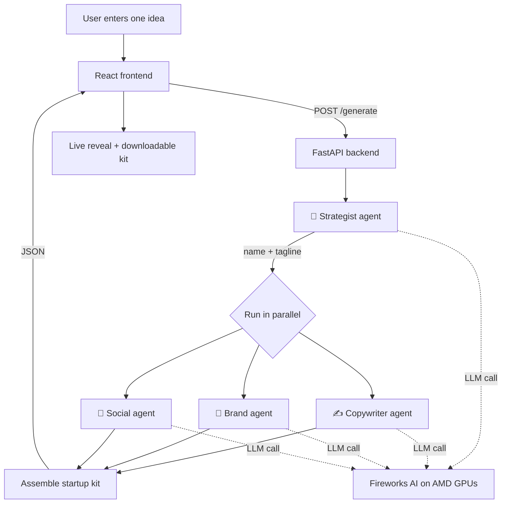

# AI Launchpad 🚀

**Turn one idea into a full startup kit in seconds.**

Type one line about a business idea and a crew of AI agents instantly generates a
startup name, a ready landing page, a brand look, and social captions — all running
on **AMD GPUs via Fireworks AI**, and downloadable as a working landing page.

Built for the **AMD Developer Hackathon: ACT II** · Unicorn Track.

---

## What it does

You enter an idea like *"an app that helps students find part-time jobs."*
A crew of four specialized AI agents goes to work — and you watch the result
appear live in seconds:

| Agent | Output |
|-------|--------|
| 🧠 Strategist | name, tagline, value proposition |
| ✍️ Copywriter | landing-page copy (hero, 3 features, CTA) |
| 🎨 Brand Designer | 5-color palette, logo concept, font style |
| 📣 Social Manager | 3 launch captions |

Then one click **downloads the whole kit** as a standalone, brand-styled HTML
landing page you can open in any browser.

---

## How it works



The **Strategist runs first** (everything depends on the name), then the other
three agents run **in parallel** for speed. Each agent is a single focused LLM
call on Fireworks AI, forced to return JSON so the frontend renders reliably.
The orchestrator is **resilient** — if one agent fails, the others still return.

---

## Features

- ⚡ **Live agent reveal** — watch the four-agent crew work, one by one
- 🎨 **Full brand kit** — name, landing page, color palette, logo mark, captions
- 🖥️ **Live landing-page preview** — rendered from the generated content
- ⬇️ **Download kit** — export a standalone, brand-styled HTML landing page
- 🔁 **Try another idea / regenerate** — run idea after idea instantly
- 🧩 **Resilient by design** — one failed agent never breaks the demo
- 🐳 **Fully containerized** — Docker + docker-compose, ready for AMD Developer Cloud

---

## Tech stack

- **Frontend:** React + Vite + Tailwind CSS
- **Backend:** Python + FastAPI
- **AI:** Fireworks AI (open models on AMD GPUs), one focused call per agent
- **Packaging:** Docker + docker-compose

---

## Run it locally (development)

### 1. Backend

```bash
cd backend
python -m venv .venv
# Windows:  .venv\Scripts\activate
# macOS/Linux:  source .venv/bin/activate
pip install -r requirements.txt
cp .env.example .env        # then add your Fireworks key (optional — mock mode works without it)
uvicorn main:app --reload --port 8000
```

The API runs at http://localhost:8000. Without a key it runs in **mock mode** and
returns sample data, so you can build and demo the UI right away.

### 2. Frontend

```bash
cd frontend
npm install
npm run dev
```

Open http://localhost:5173.

---

## Run it with Docker (production-style)

```bash
# from the project root, with backend/.env present
docker compose up --build
```

- Frontend: http://localhost:3000
- Backend:  http://localhost:8000

---

## Configuration

Set these in `backend/.env`:

```
FIREWORKS_API_KEY=fw_xxxxxxxxxxxxxxxx     # your Fireworks key
FIREWORKS_MODEL=accounts/fireworks/models/llama-v3p1-8b-instruct
USE_MOCK=false                            # true = sample data, no API calls
```

`USE_MOCK=true` forces sample data even with a key set — handy for building the UI
or demoing offline.

---

## Project structure

```
AI launchpad/
├── backend/
│   ├── main.py            FastAPI app + /generate route
│   ├── agents.py          the 4-agent crew + resilient orchestrator
│   ├── requirements.txt
│   ├── .env.example
│   └── Dockerfile
├── frontend/
│   ├── src/
│   │   ├── App.jsx                    input, agent reveal, orchestration
│   │   ├── kit.js                     downloadable HTML kit builder
│   │   └── components/
│   │       ├── AgentProgress.jsx      live agent crew UI
│   │       └── ResultKit.jsx          renders the startup kit
│   ├── package.json
│   └── Dockerfile
├── docker-compose.yml
├── agent-prompts.md
└── PITCH_AND_DEMO_SCRIPT.md
```

---

## AMD compute usage

AI Launchpad runs its agent crew on **AMD compute**. The backend talks to any
OpenAI-compatible endpoint, so inference runs on AMD hardware in two ways:

- **Fireworks AI** — every agent is an LLM call served on **AMD GPUs** via
  Fireworks AI (recommended models: MiniMax, Kimi K series).
- **AMD Developer Cloud** — the same agents can run against a model we host on an
  **AMD Developer Cloud GPU instance** (≈48 GB) using vLLM, with no code changes —
  just point `FIREWORKS_BASE_URL` at the vLLM server.

Full setup for both paths is in **[AMD_DEPLOYMENT.md](AMD_DEPLOYMENT.md)**.
The app is also containerized with Docker for reproducible deployment.

*AI Launchpad — the fastest way from idea to launch, for every founder, student,
and creator.*
